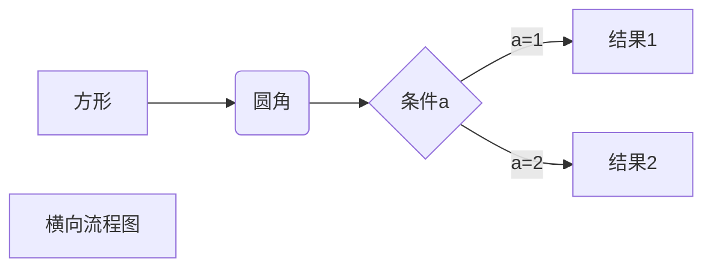
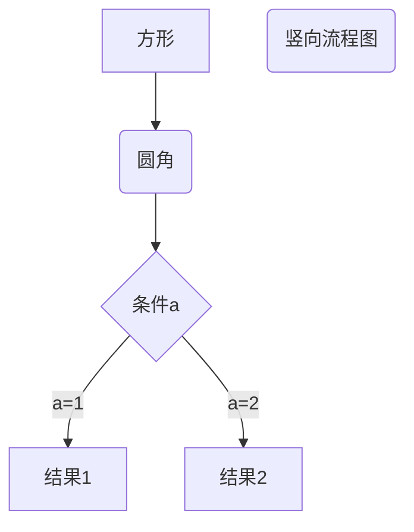

🌐 [English](./principles.md)
# 原理解释
该项目实现了极高的micropython文件上传和下载速度（参考[README_zh.md](../README_zh.md)），得益于其复杂的工作原理。原理如下：

$$
\text{*程序开始运行*}
\\|\\|\\
\text{连接串口}
\\|\\|\\
\text{发送重启信号}^{1}\text{，使设备重启}
\\|\\|\\
\text{发送中断信号}^{2}\text{，使设备进入REPL模式}
\\|\\|\\
\text{发送一段代码，并使用exec执行}
\\|\\|\\
\text{*代码开始运行*}
\\|\\|\\
\text{覆盖REPL串口}
$$

